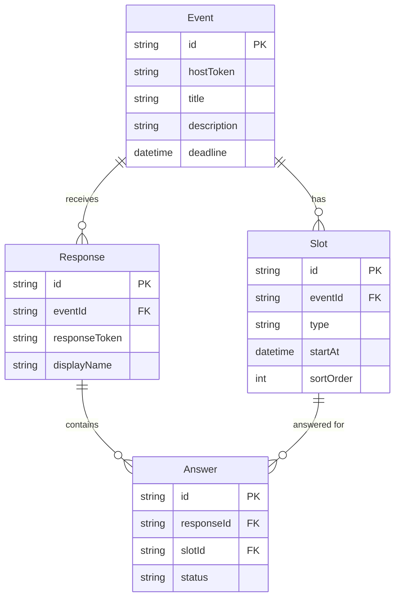

# 予定調整 Web アプリ — 設計・実装計画

## 1. プロジェクト概要

### 目的
ログイン不要で、ホストが予定候補日を提示し、ゲストが出席可能日を回答できる **予定調整（日程調整）Web アプリ** を構築する。

### 参考イメージ
Doodle / LettuceMeet / 調整さん に近い UX。ただし **アカウント登録・ログインは一切不要** とし、URL トークンによるアクセス制御で完結させる。

### スコープ（MVP）
| 含める | 含めない（将来検討） |
|--------|----------------------|
| 候補日の複数登録（日付のみ / 日時） | ユーザーアカウント・OAuth |
| 概要テキストの自由記述 | メール通知・リマインダー |
| ゲスト用・ホスト用リンクの発行 | カレンダー連携（Google Calendar 等） |
| ゲストの出席可能日回答 | リアルタイム共同編集 |
| 回答期限の設定 | 多言語対応 |
| ホストによる後からの修正 | 有料プラン・課金 |

---

## 2. ユーザーストーリー

### ホスト
1. トップページから「新しい予定を作成」できる
2. 予定の概要（タイトル・説明）を自由記述できる
3. 候補日を **日付のみ** または **日時** で複数件追加できる
4. 回答期限（任意）を設定できる
5. 作成後、**ゲスト用リンク** と **ホスト管理用リンク** が表示される
6. ホスト管理用リンクから、概要・候補日・回答期限を後から修正できる
7. ゲストの回答状況を一覧で確認できる

### ゲスト
1. 共有されたリンクを開くと、予定概要と候補日一覧が見える
2. ログインなしで、自分の名前（表示名）を入力して回答できる
3. 各候補日について「出席可 / 出席不可」の 2 値で選択できる
4. 回答を送信・後から更新できる（同一ブラウザでは再編集可能）
5. 他の予定の URL を推測してアクセスすることは困難

---

## 3. 機能要件

### 3.1 予定（Event）の作成
| 項目 | 仕様 |
|------|------|
| タイトル | 必須、最大 100 文字 |
| 説明 | 任意、最大 2000 文字（Markdown は MVP ではプレーンテキスト） |
| 候補日 | 1 件以上必須、上限 30 件（MVP） |
| 候補日の種別 | `date`（日付のみ）または `datetime`（日時） |
| 回答期限 | 任意。未設定の場合は無期限 |
| 作成時の識別子 | `eventId`（ゲスト用 URL）、`hostToken`（ホスト管理用 URL）を自動生成 |

### 3.2 候補日（Slot）
| 項目 | 仕様 |
|------|------|
| 表示 | 種別に応じて「2026/06/24」または「2026/06/24 14:00」 |
| 並び順 | 開始日時の昇順（ホストが手動並び替えは MVP 外） |
| 削除 | ホストが候補日を削除可能。既存回答がある候補の削除時は **確認ダイアログ** を表示。削除後、該当する回答（Answer）も削除 |

### 3.3 ゲスト回答（Response）
| 項目 | 仕様 |
|------|------|
| 表示名 | 必須、最大 50 文字 |
| 各候補への回答 | `available`（出席可）/ `unavailable`（出席不可）の **2 値のみ**。「未定」は含めない |
| 再回答 | 同一 `responseToken`（Cookie または localStorage）で上書き更新可能 |
| 重複防止 | 表示名の重複は許可（同名ゲストが複数いるケースを想定） |

### 3.4 ホストの修正
| 編集可能 | 編集不可（MVP） |
|----------|----------------|
| タイトル・説明 | `eventId` / `hostToken` |
| 候補日の追加・削除 | — |
| 回答期限の変更・解除 | — |
| — | 既存回答の削除（ホストによる強制削除は MVP 外） |

### 3.5 回答期限
- 期限前: ゲストは回答・更新可能
- 期限後: ゲスト画面は閲覧のみ（回答フォーム非表示、「回答期限を過ぎています」と表示）
- ホスト管理画面: 期限後も閲覧・修正は可能

### 3.6 アクセス制御（ログイン代替）
| トークン | 用途 | 形式 |
|----------|------|------|
| `eventId` | ゲスト閲覧・回答 | `nanoid(21)` 以上（推測困難） |
| `hostToken` | ホスト管理 | `nanoid(32)` 以上（ゲスト用より長く） |
| `responseToken` | ゲスト個人の再編集 | 回答作成時に発行、Cookie に保存 |

**URL 例**
```
ゲスト用:   https://example.com/e/{eventId}
ホスト用:   https://example.com/e/{eventId}/manage?token={hostToken}
```

---

## 4. 画面一覧

| # | 画面 | パス | 説明 |
|---|------|------|------|
| 1 | トップ | `/` | 新規作成への導線、簡単な説明 |
| 2 | 予定作成 | `/new` | フォーム：概要・候補日・回答期限 |
| 3 | 作成完了 | `/e/{eventId}/created?token={hostToken}` | ゲスト用・ホスト用リンク表示、コピーボタン |
| 4 | ゲスト回答 | `/e/{eventId}` | 概要表示、回答マトリクス or リスト |
| 5 | ホスト管理 | `/e/{eventId}/manage` | 回答一覧、編集、リンク再表示 |
| 6 | 404 / 無効 | — | 存在しない ID、無効な hostToken |

---

## 5. データモデル

```
Event
├── id              : string (PK, nanoid)
├── hostToken       : string (unique, indexed)
├── title           : string
├── description     : string | null
├── deadline        : datetime | null
├── createdAt       : datetime
├── updatedAt       : datetime
└── slots[]         : Slot

Slot
├── id              : string (PK)
├── eventId         : string (FK)
├── type            : "date" | "datetime"
├── startAt         : datetime  // date の場合は JST 00:00 で保存。表示も JST 固定
└── sortOrder       : int

Response
├── id              : string (PK)
├── eventId         : string (FK)
├── responseToken   : string (unique, indexed)
├── displayName     : string
├── createdAt       : datetime
├── updatedAt       : datetime
└── answers[]       : Answer

Answer
├── id              : string (PK)
├── responseId      : string (FK)
├── slotId          : string (FK)
└── status          : "available" | "unavailable"
```

### ER 図（概念）



---

## 6. API 設計（REST）

| Method | Path | 認可 | 説明 |
|--------|------|------|------|
| POST | `/api/events` | なし | 予定作成 → `{ eventId, hostToken, urls }` |
| GET | `/api/events/{eventId}` | eventId | 予定＋候補日取得（ゲスト向け） |
| GET | `/api/events/{eventId}/manage` | hostToken (query) | 予定＋候補日＋全回答取得 |
| PATCH | `/api/events/{eventId}` | hostToken | 予定・候補日・期限の更新 |
| POST | `/api/events/{eventId}/responses` | eventId + 期限内 | 回答作成 |
| PUT | `/api/events/{eventId}/responses/{responseToken}` | responseToken | 回答更新 |
| GET | `/api/events/{eventId}/summary` | eventId | 集計（各候補の可・不可人数） |

---

## 7. 技術スタック（推奨）

| レイヤ | 選定 | 理由 |
|--------|------|------|
| フレームワーク | **Next.js 15 (App Router)** | フルスタック一体、API Routes、デプロイ容易 |
| 言語 | **TypeScript** | 型安全、Agent 実装時の認識ズレ低減 |
| DB | **SQLite + Prisma** | 本番含め SQLite のみ（Postgres 等への移行はスコープ外） |
| スタイル | **Tailwind CSS** | 高速 UI 実装 |
| ID 生成 | **nanoid** | 短く推測困難なトークン |
| 日時 | **date-fns** + `Intl` | **JST 固定**で表示・入力・保存 |
| バリデーション | **Zod** | API・フォーム共通スキーマ |
| デプロイ | **Vercel**（任意） | Next.js 標準 |

---

## 8. Agent Team 構成とタスク分割

### 8.1 ロール定義

| エージェント | 担当範囲 |
|--------------|----------|
| **architect** | Prisma スキーマ、API 設計実装、共通型・Zod スキーマ |
| **frontend** | 全画面 UI、フォーム、回答マトリクス、リンクコピー UX |
| **qa** | 受け入れテスト、エッジケース確認、README 更新 |

### 8.2 実装フェーズ（推奨順序）

```mermaid
gantt
    title 実装スケジュール（目安 3〜4 時間）
    dateFormat HH:mm
    axisFormat %H:%M

    section Phase 0
    プロジェクト初期化・Prisma  :p0, 00:00, 30m

    section Phase 1
    API（作成・取得）            :p1, after p0, 45m

    section Phase 2（並列可）
    作成・完了画面               :p2a, after p1, 45m
    ゲスト回答画面               :p2b, after p1, 45m

    section Phase 3
    ホスト管理・編集             :p3, after p2a, 45m

    section Phase 4
    統合・QA・期限ロジック       :p4, after p3, 30m
```



### 8.3 タスク詳細

#### Phase 0: 基盤（architect）— 30 分
- [ ] `create-next-app` + Tailwind + Prisma + SQLite セットアップ
- [ ] Prisma スキーマ定義・マイグレーション
- [ ] 共通型・Zod スキーマ（`lib/schemas.ts`）
- [ ] nanoid ユーティリティ

#### Phase 1: API コア（architect）— 45 分
- [ ] `POST /api/events` — 作成
- [ ] `GET /api/events/[eventId]` — ゲスト向け取得
- [ ] `GET /api/events/[eventId]/manage` — ホスト向け取得（hostToken 検証）
- [ ] `POST /api/events/[eventId]/responses` — 回答作成
- [ ] `GET /api/events/[eventId]/summary` — 集計

#### Phase 2a: 作成フロー（frontend）— 45 分
- [ ] `/` トップページ
- [ ] `/new` 作成フォーム（候補日の動的追加、日付/日時切替）
- [ ] `/e/[eventId]/created` リンク表示・コピー

#### Phase 2b: ゲスト回答（frontend）— 45 分（Phase 1 完了後に並列開始可）
- [ ] `/e/[eventId]` ゲスト画面
- [ ] 回答フォーム（表示名 + 候補ごとの可/不可）
- [ ] 回答送信・Cookie に responseToken 保存
- [ ] 期限切れ時の表示切替

#### Phase 3: ホスト管理（frontend + architect）— 45 分
- [ ] `/e/[eventId]/manage` 管理画面
- [ ] 回答一覧テーブル（行=ゲスト、列=候補日、○/× 表示）
- [ ] `PATCH /api/events/[eventId]` — 編集 API
- [ ] 編集フォーム（概要・候補追加削除・期限）

#### Phase 4: 仕上げ（qa + 全員）— 30 分
- [ ] 無効トークン・存在しない eventId のエラーハンドリング
- [ ] 回答期限のバリデーション（過去日は作成時に警告）
- [ ] 受け入れ基準チェック（下記 §10）
- [ ] README（起動方法・環境変数）

---

## 9. UI/UX 方針

### ゲスト回答画面
- **マトリクス形式**を推奨：横軸=候補日、縦軸=自分の回答行
- ホスト向けサマリーは「各候補の出席可人数」を強調表示し、最多の候補をハイライト
- モバイルファースト（スマホからリンクを開く想定）

### ホスト管理画面
- ページ上部にゲスト用リンク（コピーボタン付き）を常時表示
- 回答が 0 件のときは「リンクを共有してください」の empty state

### トーン
- シンプル・軽量。装飾より **操作の明確さ** を優先

---

## 10. 受け入れ基準（Definition of Done）

### 必須
- [ ] ログインなしで予定を作成できる
- [ ] 候補日を日付のみ・日時の両方で 2 件以上登録できる
- [ ] 作成後にゲスト用・ホスト用の URL が表示され、コピーできる
- [ ] ゲストが URL から回答でき、各候補に可/不可を付けられる
- [ ] ゲストが同一ブラウザから回答を更新できる
- [ ] ホストが管理 URL から全回答を一覧できる
- [ ] ホストが概要・候補日・回答期限を後から変更できる
- [ ] 既存回答がある候補日を削除する際、確認ダイアログが表示される
- [ ] 日時はすべて JST で表示・入力される
- [ ] 回答期限後、ゲストは新規回答・更新ができない
- [ ] ランダムでない eventId では他予定にアクセスできない（404）
- [ ] 正しい hostToken なしでは管理画面にアクセスできない

### 推奨（時間があれば）
- [ ] 各候補の「出席可」人数の集計表示
- [ ] 候補日追加時の重複チェック
- [ ] 基本的なレート制限（作成 API）

---

## 11. セキュリティ・運用上の注意

| リスク | 対策 |
|--------|------|
| URL 推測による不正アクセス | nanoid（十分なエントロピー）、404 で存在を漏らさない |
| hostToken 漏洩 | 管理 URL はホストのみに共有する旨を UI で明示 |
| スパム作成 | MVP では IP ベースの簡易レート制限（任意） |
| XSS | React デフォルトエスケープ、説明文はプレーンテキスト表示 |
| データ永続化 | SQLite ファイルのバックアップ方針を README に記載 |

---

## 12. ディレクトリ構成（案）

```
imin-260624/
├── docs/
│   └── design.md          # 本ドキュメント
├── prisma/
│   └── schema.prisma
├── src/
│   ├── app/
│   │   ├── page.tsx                    # トップ
│   │   ├── new/page.tsx                # 作成
│   │   ├── e/[eventId]/
│   │   │   ├── page.tsx                # ゲスト回答
│   │   │   ├── created/page.tsx        # 作成完了
│   │   │   └── manage/page.tsx         # ホスト管理
│   │   └── api/
│   │       └── events/
│   │           ├── route.ts
│   │           └── [eventId]/
│   │               ├── route.ts
│   │               ├── manage/route.ts
│   │               ├── summary/route.ts
│   │               └── responses/
│   │                   ├── route.ts
│   │                   └── [responseToken]/route.ts
│   ├── components/
│   │   ├── EventForm.tsx
│   │   ├── SlotPicker.tsx
│   │   ├── ResponseMatrix.tsx
│   │   └── CopyLinkButton.tsx
│   └── lib/
│       ├── db.ts
│       ├── schemas.ts
│       └── tokens.ts
├── .cursor/
│   ├── agents/
│   │   ├── architect.md
│   │   ├── frontend.md
│   │   └── qa.md
│   └── rules/
│       └── project.mdc
└── README.md
```

---

## 13. 決定事項

| # | 項目 | 決定内容 |
|---|------|----------|
| 1 | ゲスト回答の選択肢 | `出席可` / `出席不可` の **2 値** |
| 2 | 「未定」オプション | **省略**（MVP に含めない） |
| 3 | タイムゾーン | **JST 固定**（表示・入力・保存すべて） |
| 4 | ホストの候補日編集 | 追加・削除 **可能**。既存回答がある候補の削除時は **確認ダイアログ** を表示 |
| 5 | データベース | **SQLite のみ**（本番環境も SQLite。他 DB への移行はスコープ外） |

---

## 14. 次のアクション

1. **Agent Team セットアップ** — `.cursor/agents/` と rules の作成
2. **Phase 0 開始** — プロジェクト初期化・Prisma スキーマ
3. **並列実装** — Phase 2a / 2b を frontend エージェントで分担

---

*作成日: 2026-06-24*
